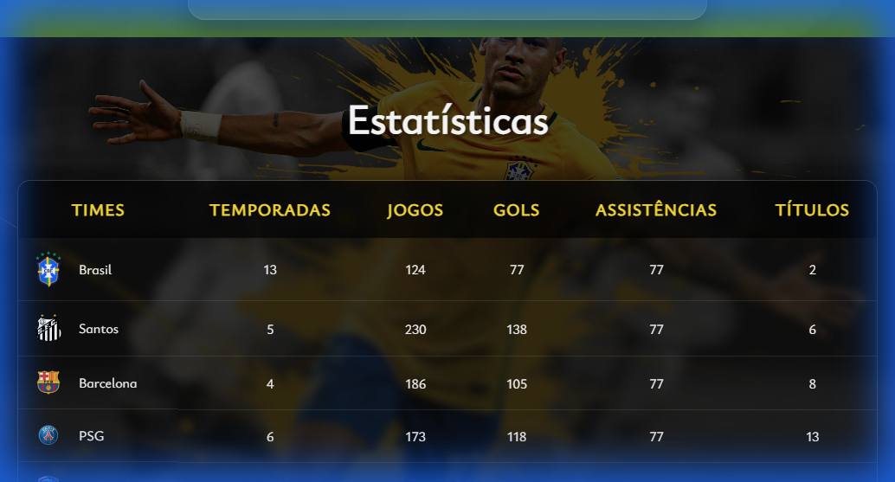

# LinkBio - Redesign Responsivo

Este projeto é uma página de "Link in Bio" aprimorada, apresentando um design moderno, responsivo e com estética premium.

## 📸 Screenshots

### Seção Principal

### Seção de Estatísticas

## 🚀 Tecnologias Utilizadas

*   **HTML5**: Estrutura semântica e organizada.
*   **CSS3**:
    *   **Flexbox**: Para layouts flexíveis e alinhamento.
    *   **CSS Variables**: Para gerenciamento consistente de cores e fontes.
    *   **Media Queries**: Para responsividade em dispositivos móveis, tablets e desktops.
    *   **Glassmorphism**: Efeito de vidro fosco para um visual moderno.
    *   **Animations**: Transições suaves e efeitos de hover.

## ✨ Melhorias Realizadas

1.  **Responsividade Total**:
    *   O layout agora se adapta perfeitamente a qualquer tamanho de tela (celular, tablet e desktop).
    *   A tabela de estatísticas possui rolagem horizontal em telas pequenas para evitar quebras.

2.  **Design Premium (Glassmorphism)**:
    *   Implementação de um efeito de vidro translúcido nos cartões e contêineres, proporcionando profundidade e sofisticação.
    *   Fundo de vídeo integrado harmoniosamente com os elementos da interface.

3.  **Tipografia e Legibilidade**:
    *   Ajuste de fontes e tamanhos para garantir uma leitura confortável em todos os dispositivos.
    *   Uso de sombras de texto para melhorar o contraste sobre o fundo de vídeo.

4.  **Interatividade**:
    *   Efeitos de hover nos links e na tabela para feedback visual ao usuário.
    *   Animações sutis para tornar a navegação mais dinâmica.

5.  **Código Limpo e Organizado**:
    *   Refatoração do HTML para melhor semântica.
    *   Uso de variáveis CSS para facilitar a manutenção e personalização.

---

### 👨‍💻 Desenvolvido por Flávio Félix
